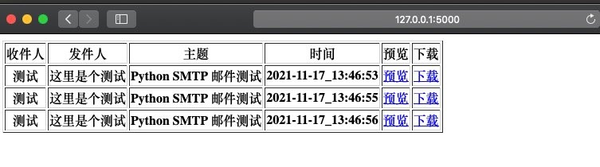

# FakeSMTP

Fake smtp server 

一个方便调试和测试使用的 smtp server

## install

```shell
pip install -r requirements.txt
```

## 运行

python flask_server.py [-p 8025 --host 0.0.0.0 --username test@test.com --password test1234] 

## 使用
- 访问 http://127.0.0.1:5000

- 注意: 邮件存在内存当中, 重启会丢失